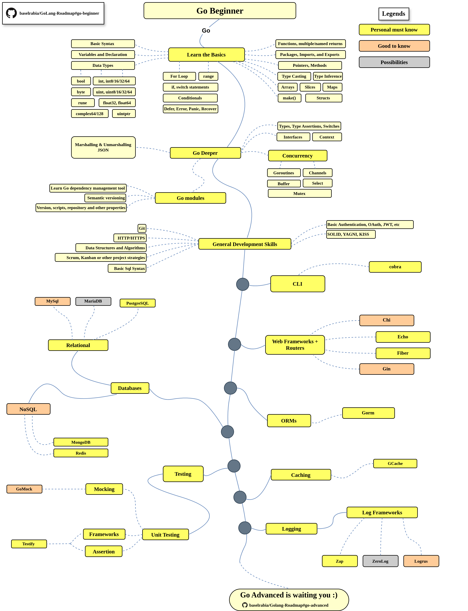
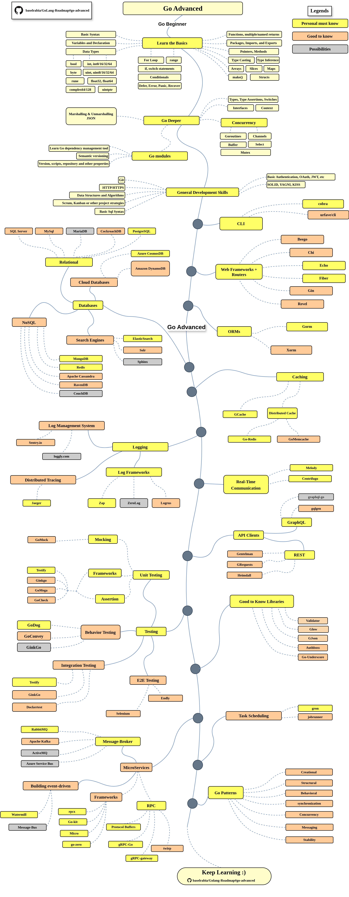

# Golang Roadmap 2024

> Golang Roadmap for becoming a [Go](https://golang.org/) developer in 2024:

The chart below is a guide that explains the paths that will take you to learn and become a Go developer. This chart is created as a helpful tip for everyone who asks, "*What should I learn next as a Go developer?*"

## Disclaimer

> GoLang Gopher Roadmap provides a clear path for your learning journey in GoLang. Our roadmap focuses on understanding the landscape, helping you choose the right tools for the job, and avoiding hype-driven choices. Dive in, explore, and enhance your skills with a well-rounded understanding of GoLang development.
## Give a Star! :star:

If you find this project useful for learning or starting your own solution, we would greatly appreciate it if you could give it a :star: star.    Thank you for your support!  
##  [Go Beginner](./go-beginner/README.md)
to get more details check on [Go Beginner Roadmap](./go-beginner/README.md)

## [Go Advanced](./go-advanced/README.md)
to get more details check on [Go Advanced Roadmap](./go-advanced/README.md)

## General Resources
for more details 
 1. first 
 2. second 

## Contribution

The roadmap is built using [Draw.io](https://www.draw.io/). Project file can be found at `golang-developer-roadmap.xml` file. To modify it, open draw.io, click **Open Existing Diagram** and choose `xml` file with project. It will open the roadmap for you. Update it, upload and update the images in readme and create a PR (export as png with 400% zoom and minify that with [Compressor.io](https://compressor.io/compress)).

- Open a pull request with improvements
- Discuss ideas in issues
- Spread the word

## License

