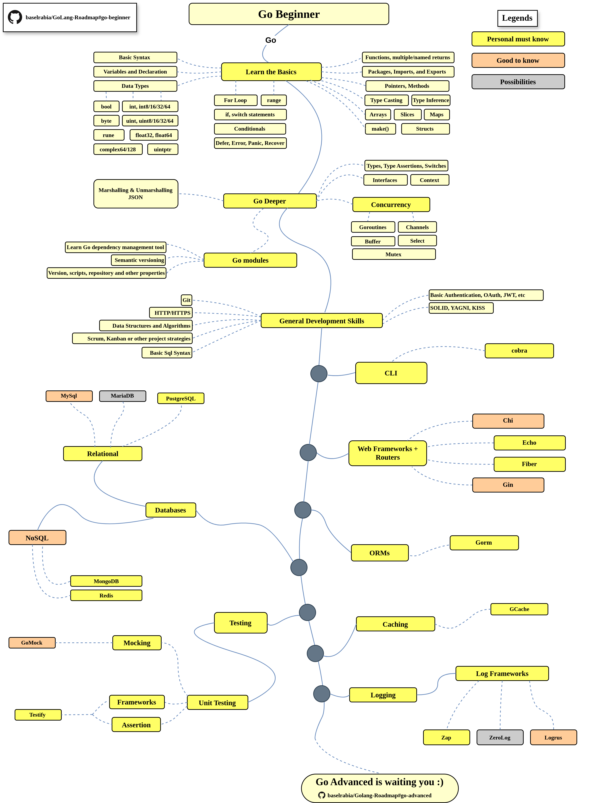

# Golang Beginner Roadmap 2024

> Golang Roadmap for becoming a [Go](https://golang.org/) developer in 2024:

The chart below is a guide that explains the paths that will take you to learn and become a Go developer. This chart is created as a helpful tip for everyone who asks, "*What should I learn next as a Go developer?*"

## Disclaimer

> GoLang Gopher Roadmap provides a clear path for your learning journey in GoLang. Our roadmap focuses on understanding the landscape, helping you choose the right tools for the job, and avoiding hype-driven choices. Dive in, explore, and enhance your skills with a well-rounded understanding of GoLang development.
## Give a Star! :star:

If you find this project useful for learning or starting your own solution, we would greatly appreciate it if you could give it a :star: star.    Thank you for your support!  
## Roadmap

## Resources

1. Prerequisites

   - [Go docs ](https://go.dev/doc/)
   - [Tour of Go](https://go.dev/tour/welcome/1)
   - [Go by Example](https://gobyexample.com/)
   - [Go Modules](https://blog.golang.org/using-go-modules)

2. General Development Skills

   - Learn GIT, create a few repositories on GitHub, share your code with other people
   - Know HTTP(S) protocol, request methods (GET, POST, PUT, PATCH, DELETE, OPTIONS)
   - Learn about implementation of a basic Authentication
   - Read a few books about algorithms and data structures
   - Solid principles, architectural & design patterns, ecc
   - Basics of software testing (unit, integration, e2e)
   - [SQL](https://www.w3schools.com/sql/default.asp)

3. CLI Tools
   1. [cobra](https://github.com/spf13/cobra)

4. Web Frameworks + Routers

   1. [Gin](https://github.com/gin-gonic/gin)
   2. [Chi](https://github.com/go-chi/chi)
   3. [Echo](https://github.com/labstack/echo)
   4. [Fiber](https://github.com/gofiber/fiber)
   
5. Databases

   1. Relational
      1. [MySQL](https://www.mysql.com/)
      2. [PostgreSQL](https://www.postgresql.org/)
      3. [MariaDB](https://mariadb.org/)
   2. NoSQL
      - [MongoDB](https://www.mongodb.com/)
      - [Redis](https://redis.io/)

6. ORMs

   1. [Gorm](https://github.com/go-gorm/gorm)

7. Caching

   1. [GCache](https://github.com/bluele/gcache)

8. Logging

   1. Log Frameworks
      - [uber-go/Zap](https://github.com/uber-go/zap)
      - [ZeroLog](https://github.com/rs/zerolog)
      - [Logrus](https://github.com/sirupsen/logrus)
  
9. Testing

    1. Unit, Behavior, Integration Testing
       1. [GoMock](https://github.com/golang/mock)
       2. [Testify](https://github.com/stretchr/testify)

## Contribution

The roadmap is built using [Draw.io](https://www.draw.io/). Project file can be found at `./go-beginner/golang-beginner-roadmap.drawio.xml` file. To modify it, open draw.io, click **Open Existing Diagram** and choose `xml` file with project. It will open the roadmap for you. Update it, upload and update the images in readme and create a PR (export as png with 400% zoom and minify that with [Compressor.io](https://compressor.io/compress)).

- Open a pull request with improvements
- Discuss ideas in issues
- Spread the word

## License

